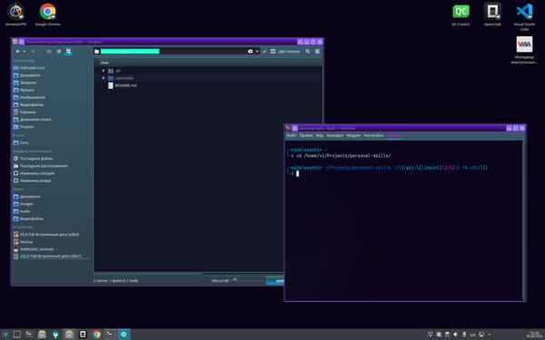
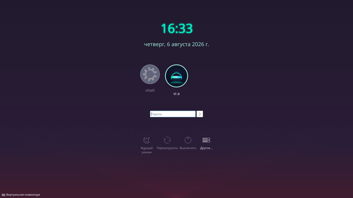
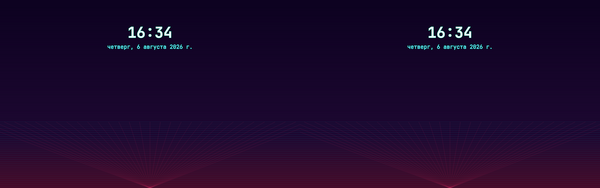

# personal-skills

Персональный набор навыков (агентов) для **opencode** — готовые инструкции-агенты, которые превращают стандартную систему в настроенную под тебя, фирменную и «вылизанную». Каждый навык — это проверенный на практике плейбук с точными командами: ставь на новую машину и получай тот же результат.

Сейчас в коллекции **1 навык** — киберпанк-кастомизация KDE Plasma.

---

## 📦 Список навыков

### 1. cyberpunk-kde — неоновая кастомизация KDE Plasma
**Что делает:** превращает KDE Plasma 5.27 (X11) на Ubuntu 24.04 в киберпанк-рабочий стол в неоновой гамме (акцент `#00ffcc`):

### 📸 Галерея (нажми на картинку, чтобы увеличить)

<table>
  <tr>
    <td align="center"><a href="assets/cyberpunk-kde.png"></a></td>
    <td align="center"><a href="assets/cyberpunk-sddm.png"></a></td>
    <td align="center"><a href="assets/cyberpunk-lockscreen.png"></a></td>
  </tr>
  <tr>
    <td align="center"><sub>Рабочий стол</sub></td>
    <td align="center"><sub>Экран входа (SDDM)</sub></td>
    <td align="center"><sub>Экран блокировки</sub></td>
  </tr>
</table>

- 🖼️ Обои-ротация каждые 10 мин (systemd-таймер)
- 🍔 Иконка и компактное меню Kickoff
- 🎨 Тема виджетов Kvantum «Cyberpunk» (тёмный navy + неон)
- 💠 Акцентный цвет Plasma (выделение, фокус)
- 🪟 Неоновые рамки окон Aurorae
- 💻 Неоновый PS1 в Konsole с git-статусом
- 🔒 Экран блокировки: кибер-обои + светящиеся часы
- 🔑 Экран входа SDDM: неоновая тема + обезличенная кибер-аватарка
- 🛠️ Чинит дубликаты виджетов панели, даёт откаты и чек-лист проверок

**Файл:** `.opencode/agent/cyberpunk-kde.md`

---

## 🚀 Как использовать навыки

### Где можно использовать
Навыки работают **в любом проекте/репозитории** на любой машине, где установлен opencode:

- **Глобально (рекомендуется)** — навык доступен в любом каталоге от твоего пользователя:
  ```bash
  mkdir -p ~/.opencode/agent
  cp .opencode/agent/*.md ~/.opencode/agent/
  ```
- **Локально в проекте** — навык доступен только внутри этого репозитория:
  - оставь файлы как есть в `.opencode/agent/`

### Активация
1. Скопируй файлы навыка (см. выше)
2. **Перезапусти opencode**
3. Готово — агент подхватится автоматически

### Запуск навыка
Просто попроси в чате opencode, например:

> «Сделай киберпанк-кастомизацию KDE по плейбуку»

Агент сам выполнит все шаги по порядку: аудит системы → применение изменений по одному с проверкой → бэкапы → откат при проблемах → отчёт. Там, где нужна перезагрузка или рестарт сессии (SDDM, KWin), он предупредит заранее.

### Требования к системе
- Ubuntu 24.04 (проверено), KDE Plasma **5.27, X11**
- Установленный **opencode**
- Права `sudo` у пользователя
- Для полного результата нужны файлы-ассеты (обои, иконки, темы) — по умолчанию навык создаёт/перекрашивает стандартные; фирменные ассеты можно положить в `~/Pictures/Wallpapers/Cyberpunk/` и `~/.local/share/` по путям из плейбука.

### Полезные приёмы
- **Только часть изменений** — скажи: «сделай только SDDM и аватар» — агент выполнит нужный раздел.
- **Проверка без риска** — агент делает бэкапы и умеет откатывать; при сомнениях он спросит.

---

## 🗂️ Структура репозитория

```
personal-skills/
├── README.md              # этот файл
└── .opencode/
    └── agent/             # агенты opencode (навыки)
        └── cyberpunk-kde.md
```

---

## ➕ Как добавить новый навык

1. Создай файл `.opencode/agent/<имя>.md` с frontmatter:
   ```yaml
   ---
   description: краткое описание, когда вызывать
   mode: subagent
   permission:
     edit: allow
     bash: allow
   ---
   ```
2. Напиши инструкции (проверенные команды, откаты, чек-лист)
3. Добавь пункт в раздел «Список навыков» этого README
4. Закоммить и запуши — на новых машинах просто `git clone` + копирование в `~/.opencode/agent/`

---

## 📄 Лицензия

Личный проект. Копируй, адаптируй, делись.
