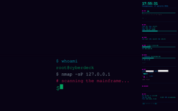

# Personal Skills for opencode

Ready-to-use **opencode agent skills** (playbooks) for system setup, desktop customization, and automation on Linux. Copy a skill, run it on a new machine, get the same polished result.

## What is this?

Each skill is a markdown file (`.opencode/agent/<name>.md`) containing step-by-step instructions, verified commands, backup/rollback procedures, and troubleshooting checklists. opencode loads them as subagents that execute the full playbook autonomously.

**Currently included:** 1 skill — cyberpunk KDE Plasma customization (with Conky system monitor).

---

## Skills

### cyberpunk-kde — Neon Cyberpunk KDE Plasma Customization

Transforms a stock KDE Plasma 5.27 (X11) desktop on Ubuntu 24.04 into a cyberpunk-themed workspace with neon accents (`#00ffcc`). The Conky section (§9) and the SDDM theme (§8, Qt6 port + neon text styling) are additionally verified on Ubuntu 26.04 + KDE Plasma 6 (Wayland).

**What it does:**
- 🖼️ Wallpaper rotation every 10 min (systemd timer)
- 🍔 Custom Kickoff icon and compact menu
- 🎨 Kvantum widget theme "Cyberpunk" (dark navy + neon)
- 💠 Plasma-wide accent color
- 🪟 Neon window frame borders (Aurorae)
- 💻 Neon PS1 prompt in Konsole with git status
- 🔒 Lock screen: cyber wallpaper + glowing clock (clock patch: Plasma 5 only; wallpaper works on both)
- 🔑 SDDM login screen: neon theme + anonymous avatar + neon texts (Qt5 theme on Plasma 5, Qt6 port on Plasma 6)
- 📊 Conky system monitor: CPU/GPU temps, VRAM, disk/network graphs, Docker, color-coded load, under-windows layer, click-through (mouse works through the panel), auto-scaling to any screen resolution
- 🛠️ Panel widget deduplication, rollback procedures, verification checklists

**Files:**
- Skill: `.opencode/agent/cyberpunk-kde.md` — narrative, commands, lessons
- Artifacts: `references/cyberpunk-kde/` — deployable file contents (Conky config, launcher, cleaner, systemd unit, C click-through tool, PS1). The skill reads them from this directory at run time, which keeps the skill file small (progressive disclosure, the standard skills pattern).

### Screenshots

<table>
  <tr>
    <td align="center"><a href="assets/cyberpunk-kde.png"></a></td>
    <td align="center"><a href="assets/cyberpunk-sddm.png"></a></td>
    <td align="center"><a href="assets/cyberpunk-lockscreen.png"></a></td>
    <td align="center"><a href="assets/cyberpunk-conky.png"></a></td>
  </tr>
  <tr>
    <td align="center"><sub>Desktop</sub></td>
    <td align="center"><sub>SDDM Login</sub></td>
    <td align="center"><sub>Lock Screen</sub></td>
    <td align="center"><sub>Conky Monitor</sub></td>
  </tr>
</table>

---

## How to use

### Install

Skills work in any project or globally on any machine with opencode installed.

**Globally (recommended):**
```bash
git clone https://github.com/valeksan/opencode-skills.git ~/Projects/personal-skills
cp ~/Projects/personal-skills/.opencode/agent/*.md ~/.opencode/agent/
```
> The clone path matters: the skill references artifacts at
> `/home/vi/Projects/personal-skills/references/cyberpunk-kde/` — clone to that
> path (or adjust the paths inside the skill once after cloning).

**Per-project (local):**
Keep `.opencode/agent/*.md` inside your repository (also copy `references/` and fix the paths).

### Run

1. Copy skill files (see above)
2. Restart opencode
3. Ask in chat: "Apply cyberpunk KDE customization from the playbook"

The agent executes everything autonomously: audit → apply changes one by one with verification → backups → rollback on issues → final report. It warns before any reboot or session restart (SDDM, KWin).

### Requirements
- Ubuntu 24.04, KDE Plasma **5.27, X11** (tested) — Conky (§9) and SDDM (§8) additionally verified on **Ubuntu 26.04, KDE Plasma 6, Wayland**
- **opencode** installed
- `sudo` access
- For full visual results, asset files (wallpapers, icons, themes) are created/repainted from defaults; custom assets can be placed in `~/Pictures/Wallpapers/Cyberpunk/` and `~/.local/share/` per playbook paths.

### Tips
- **Partial application:** Say "only do SDDM and avatar" — the agent runs only that section.
- **Safe preview:** Agent creates backups and can roll back; it asks when uncertain.

---

## Adding new skills

1. Create `.opencode/agent/<name>.md` with frontmatter:
   ```yaml
   ---
   description: when to trigger this skill
   mode: subagent
   permission:
     edit: allow
     bash: allow
   ---
   ```
2. Write instructions (verified commands, rollback procedures, checklists)
3. Add an entry to the Skills section in this README
4. Commit and push — on new machines, just `git clone --depth=1` + copy to `~/.opencode/agent/`

---

## Repository structure

```
personal-skills/
├── README.md
├── assets/                  # screenshots
├── references/
│   └── cyberpunk-kde/       # deployable artifacts (conky.conf, scripts, unit, C tool, PS1)
└── .opencode/
    └── agent/               # opencode skills
        └── cyberpunk-kde.md
```

---

## License

Personal project. Copy, adapt, share.
